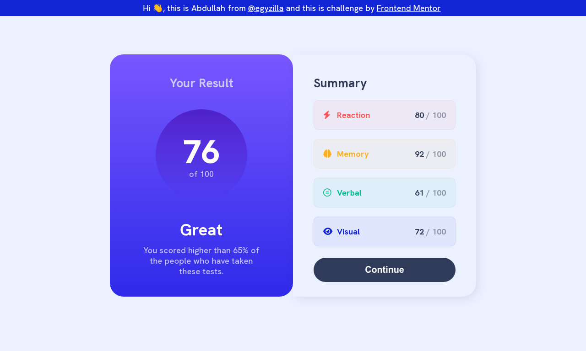

# Abdullah Egyzilla - Results summary component

## Welcome! 👋

**To do this challenge, you need a basic understanding of HTML and CSS.**

## The challenge

Your challenge is building out this results summary component and getting it as close to the design as possible.

You can use any tools you like to help you complete the challenge. So if you've got something you'd like to practice, feel free to give it a go.

Your users should be able to:

View the optimal layout for the interface depending on their device's screen size
See hover and focus states for all interactive elements on the page

### Links

- [Challenge](https://www.frontendmentor.io/challenges/results-summary-component-CE_K6s0maV)
- [Solution](https://github.com/egyzilla/results-summary-component)
- [Live Site](https://egyzilla.github.io/results-summary-component/)

## My process

### Built with

- Semantic HTML5 markup
- CSS custom properties
- Flexbox

## Author

- Instagram - [@egyzilla](https://www.instagram.com/egyzilla/)
- GitHub - [@egyzilla](https://github.com/egyzilla)
- Frontend Mentor - [@egyzilla](https://www.frontendmentor.io/profile/egyzilla)

